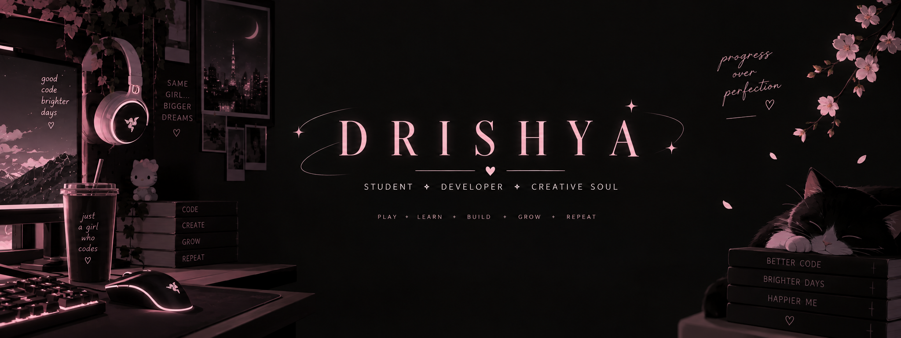

<!-- BANNER -->

 

<!-- TYPING ANIMATION -->

  

<!-- PROFILE VIEWS -->

  

<!-- SOCIAL BADGES -->

---

## 🌸 About Me

I'm a student developer who enjoys building projects, learning new technologies, and turning ideas into working things. 🌸

- 🎓 Student & developer
- 💻 Interested in software and web development
- 🎮 Gamer at heart
- ✨ Creative outside of code
- 🚀 Always building, learning and experimenting

---

## 🛠️ Tech I Work With

---

## 🌱 Currently Learning

---

## 🚀 Featured Projects

### 🎬 MyTube

A youtube inspired video streaming platform.

**Tech:** `Next.js` `React` `Node.js` `Express` `MongoDB`

---

### 🎙️ JULIA — The Talking Agent

An AI talking agent designed to enable natural, real-time voice conversations.

> 🚧 **Under construction**

---

### 📚 AI Study Pal

A fully Python-based application designed to help students manage their schedules and study materials.

---

## 💻 Coding Vibes

  

### ✨ Code. Create. Break. Fix. Repeat. ✨

---

## 📊 GitHub Stats

---

## 🔥 Contribution Streak

---

## 🐍 My Contribution Graph

---

## 🎀 Random Developer Energy

  

